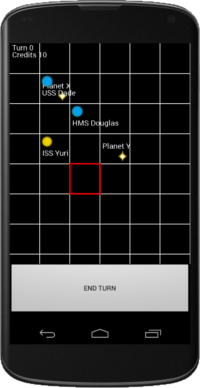

gc 
==

Open-source Android game. Still a work-in-progress after all these years.

Download it [HERE](https://github.com/chorhatarahuduketuri/gc/releases/latest).

## Summary 

GalaxyQuest is a turn-based strategy game that focuses on building a galactic empire 
and conquering other competitive ships within the galaxy.  

Features will eventually include at least:

* Colonising and developing systems
* Building fleets of ships 
* Attacking and defending systems
* Commanding fleets and destroying enemy ships
* Dealing with spacial anomalies and natural disasters

...with potential for a whole lot more.

Multi-player and cross platform support are not our goals, but these may not be 
difficult to add.

## Building

GC supports Android 4.1 onwards. It might work on older versions.

If you are using Android Studio to build this, you should open this directory 
and then select File -> Sync Project with Gradle Files. You should then be able 
to build and run the project.

## Preview

